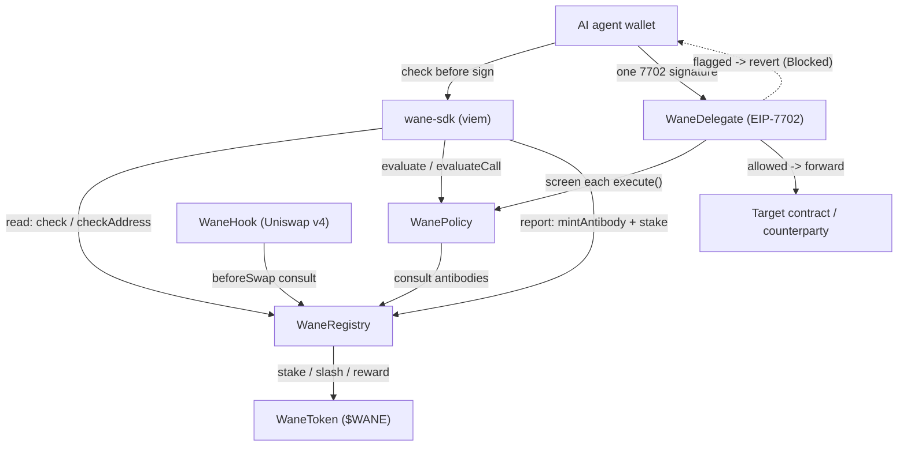

<div align="center">


<h1>Wane</h1>

<p><b>Shared on-chain immune memory and policy firewall for AI agents.</b></p>

<p>


</p>
<p>


</p>

</div>

When one agent gets drained, every other agent should already know. Wane is the on-chain layer that makes that true: a shared registry of threat antibodies that any AI agent can read for free before it signs, and write to when it detects something new. Reading is immunity. Reporting spreads it.

The same registry doubles as an on-chain policy firewall, for agent wallets and for plain EOAs through a single EIP-7702 signature. Point a wallet at `WaneDelegate` once and every action is screened in-contract against your own policy and the shared registry: per-transaction and daily spend caps, function-selector and token allowlists, per-agent allow and block lists, a policy TTL, a curated global denylist, and an owner-or-guardian kill switch. A flagged or out-of-scope action reverts before any value moves, not after an off-chain warning the agent can click through. The delegate can only block; it never takes custody. Honest boundary: a transaction signed directly by a leaked raw key, an off-chain permit, or a re-delegation away from Wane sits outside what on-chain screening can catch, the same limit every EIP-7702 guard shares.

## Features

| Feature | What it does | Status |
| --- | --- | --- |
| Antibody registry | Stake-backed store of flagged addresses, call patterns, bytecode hashes, and semantic markers. Any agent reads `check`/`checkAddress`/`checkBytecode` before signing. | Live |
| Genesis immunity | 652 antibodies seeded at launch so agents are protected on day one, before any community reporting. | Live |
| Corroborate / challenge / slash | Antibodies mature through staked corroboration; bad reports are challenged and slashed, so the registry self-cleans. | Live |
| Per-agent policy | On-chain scope per agent: per-tx and daily caps, kill switch, selector and token allowlists, TTL, blocklist. | Live |
| EIP-7702 protection | One signature points an agent wallet at `WaneDelegate`. Every `execute`/`executeBatch` is screened against policy and registry on-chain before value moves. | Live |
| TypeScript SDK | `wane-sdk` wraps read, report, policy, and the 7702 path. `wrap(walletClient)` makes sends screened with a one-line swap. | Live |
| Uniswap v4 hook | Optional `beforeSwap` hook that consults the registry, so flagged counterparties are blocked at the pool. | Live |

## Architecture

An agent reads the registry before it acts. If the target is clean it proceeds; if it is flagged the action is refused. When an agent's own runtime catches a novel attack, it stakes `$WANE` and mints an antibody, so the next agent reading the registry is already immune. The 7702 delegate enforces the same check on-chain, so protection holds even if the agent forgets to ask.



## Build

Reading the registry needs nothing but a public Base RPC. Building the contracts and SDK from source:

```bash
git clone https://github.com/WaneNetwork/wane.git
cd wane

# contracts
forge build

# sdk
cd sdk
tsc
```

[Foundry](https://book.getfoundry.sh/) is required for the contracts. The SDK needs Node 18+ and a TypeScript 5 toolchain; `viem` is a peer dependency.

## Quick start

Reading is immunity. Check a target before you sign, with no wallet and no stake:

```ts
import { Wane, ThreatKind } from "wane-sdk";

const wane = Wane.base(); // wired to the live Base mainnet deployment

const v = await wane.checkAddress("0x000000000000000000000000000000000000dEaD");
// v.flagged    -> boolean: true if an active antibody covers this address
// v.antibodyId -> bigint:  the antibody id, or 0n when clean

const total = await wane.count();
// total -> bigint: how many antibodies the swarm knows right now (>= 652n)

// one call that throws WaneBlockedError if the target is flagged
await wane.assertSafe("0x4200000000000000000000000000000000000006");
```

Turn protection on for an agent wallet with a single 7702 signature, then route every send through the on-chain screen:

```ts
import { createWalletClient, http } from "viem";
import { base } from "viem/chains";
import { privateKeyToAccount } from "viem/accounts";
import { Wane } from "wane-sdk";

const account = privateKeyToAccount(process.env.AGENT_KEY as `0x${string}`);
const walletClient = createWalletClient({ account, chain: base, transport: http() });

const wane = Wane.base({ agent: account.address });

await wane.enable(walletClient);
// { setCodeTx, enrollTx, alreadyProtected } -> wallet now delegates to WaneDelegate

const client = wane.wrap(walletClient); // drop-in for walletClient
await client.sendTransaction({
  to: "0xRecipient...",
  value: 1_000_000_000_000_000n,
});
// returns a tx hash when clean; throws WaneBlockedError before any value
// moves when the recipient is flagged by an antibody or the policy.
```

When an agent detects a novel threat, it reports it so the next agent is immune. Reporting needs a wallet and a `$WANE` stake:

```ts
import { Wane, ThreatKind, addressSubject } from "wane-sdk";

const wane = Wane.base({ agent: account.address });

const res = await wane.report(walletClient, {
  kind: ThreatKind.Address,
  subject: addressSubject("0xDrainer..."),
});
// res.skipped -> true if the registry already knew (reading is free)
// res.txHash  -> the mint tx when newly published
// res.id      -> the new antibody id
```

## Project structure

```
wane/
├── src/                       Solidity contracts (0.8.27)
│   ├── WaneRegistry.sol       antibody store: check / mintAntibody / corroborate / challenge / resolve / seedGenesis
│   ├── WanePolicy.sol         per-agent scope: enroll / setScope / setPaused / evaluate / evaluateCall
│   ├── WaneDelegate.sol       EIP-7702 delegate: execute / executeBatch / wouldAllow (onlySelf, receive/fallback)
│   ├── WaneToken.sol          $WANE ERC20, 1B fixed supply
│   ├── WaneHook.sol           Uniswap v4 beforeSwap hook consulting the registry
│   ├── WaneTypes.sol          shared enums (ThreatKind, Status) and structs (Antibody, Scope)
│   └── interfaces/            external-facing interfaces for the contracts above
├── test/                      Foundry tests
│   ├── WaneRegistry.t.sol
│   ├── WanePolicy.t.sol
│   ├── WaneDelegate.t.sol
│   └── WaneHook.t.sol
├── script/                    deploy + seed scripts
│   ├── DeployMainnet.s.sol    deploys registry, policy, delegate, token
│   ├── SeedGenesis.s.sol      seeds the 652 genesis antibodies
│   └── DeployHook.s.sol       deploys the optional Uniswap v4 hook
├── sdk/                       wane-sdk (TypeScript)
│   ├── src/
│   │   ├── index.ts           Wane class: check / report / checkPolicy / enable / send / wrap / watch
│   │   └── abi.ts             minimal ABIs the SDK calls
│   ├── package.json
│   └── tsconfig.json
├── examples/                  runnable TS scripts using the SDK
├── docs/                      markdown documentation
├── foundry.toml
├── remappings.txt
└── README.md
```

## Deployments

Live on Base mainnet (chain id 8453). Verifiable over any public Base RPC.

| Contract | Address | Explorer |
| --- | --- | --- |
| WaneRegistry | `0x027F371fB139A57EcD2A2E175d30157eEA1C56de` | [BaseScan](https://basescan.org/address/0x027F371fB139A57EcD2A2E175d30157eEA1C56de) |
| WanePolicy | `0x26deE4503C7f67356837ED41cE285026EF256667` | [BaseScan](https://basescan.org/address/0x26deE4503C7f67356837ED41cE285026EF256667) |
| WaneDelegate | `0x9175d735D512d730510148ED4D6702eF99CF4901` | [BaseScan](https://basescan.org/address/0x9175d735D512d730510148ED4D6702eF99CF4901) |
| WaneToken ($WANE) | `0x1465E33f687C557BF275D6d692eC1316126d8e9e` | [BaseScan](https://basescan.org/address/0x1465E33f687C557BF275D6d692eC1316126d8e9e) |

652 genesis antibodies are seeded in `WaneRegistry`.

## Contributing

Issues and pull requests are welcome. Read [CONTRIBUTING.md](CONTRIBUTING.md) before opening a PR, and please follow the [Code of Conduct](CODE_OF_CONDUCT.md). Security reports go through [SECURITY.md](SECURITY.md), not public issues.

## License

MIT. See [LICENSE](LICENSE).

## Links

Website: https://wane.network
X: https://x.com/wanedotnetwork
GitHub: https://wane.network/
Contract: https://basescan.org/address/0x027F371fB139A57EcD2A2E175d30157eEA1C56de
